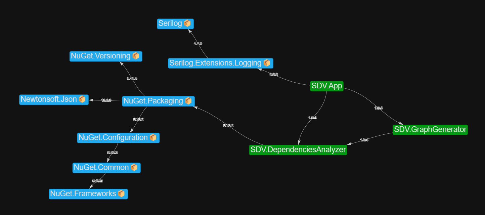

# SDV - Solution Dependencies Visualiser


This tool visualises dependencies between projects and nuget packages
within the .NET Core or .NET Framework solutions.

#### Have you ever:

- struggled to upgrade nuget packages in large solutions because of version
  mismatch between packages with unclear dependencies?
- seek for common nuget packages in different packages or even solutions?
- be just curious about the solution structure and dependencies?

If you have positive answer to any of these, you definitely should try this tool.

## Features

- Visualisation of solution dependencies on nuget packages
  with indication of their versions
- Visualisation of dependencies between projects within solution
- Multi solution mode for comparing dependencies between solutions
- Filter mode to hide/show specific packages and projects
- Output is a standalone html file, which can be easily saved or shared

## Demo

Here is a preview of output


But you can also check functional output demo [here](https://andriilab.github.io/demo-pages/SDV.html)

## Prerequisites

- Windows platform (only supported for now by GUI)
- [.NET 9](https://dotnet.microsoft.com/en-us/download/dotnet/9.0)

## Installation

No installation needed, just download latest binary
from [releases](https://github.com/AndriiLab/SDV/releases) and execute

### or make

## Build from source

1. Download repo and restore packages
2. Go to folder `SDV.GraphGenerator`  and run

```powershell
  npm install
```

3. Build and run project `SDV.App`

## Hints

- Restore and build examined solution to get output from this tool
- Use exclusion mode with `Microsoft.` and `System.` packages filtered for most
  cases (otherwise you'll be overcrowded with dependencies)
- Use inclusion mode with specified package prefixes for very large projects

## Contributing

Contributions are always welcome!

- Please, create an [issue](https://github.com/AndriiLab/SDV/issues/new) or
- make a [PR](https://github.com/AndriiLab/SDV/pulls)
if you want to facilitate issue resolution

## Acknowledgements

- [nuget-deps-tree](https://github.com/jfrog/nuget-deps-tree) - a Type Script
  package, which was used as a starting point for logic of `SDV.DependenciesAnalyzer` project
- [DependenSee](https://github.com/madushans/DependenSee) served as a source of inspiration
  for visualisation graph and output result
- [vis-network](https://github.com/visjs/vis-network) - a Type Script
  package for visualisation of relationships between nodes 
